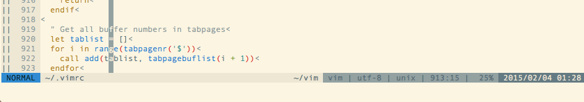

vim-shellutils
===

[](https://travis-ci.org/b4b4r07/vim-shellutils)
[](https://ci.appveyor.com/project/b4b4r07/vim-shellutils)


`vim-shellutils` is a simple, UNIX Shell commands (e.g. `/bin/ls`) emulator that works even in a non-Unix environment (Windows ;-), written in Vim script.

***DEMO:***



## Description

`vim-shellutils` is a simple tool that provides UNIX shell-like commands such as `'rm'`, `'ls'`, and so on.

The fact that is written in Vim script only will bring you a lot of advantages. For example, if you run the shell command in light manner, you can emulate the shell command without exiting Vim. With further say, this fact shows that does not depend on the platform you want to run. This means that Windows is OK.

If even Vim and `vim-shellutils`, it is possible to realize a shell command mock.

## Requirement

- Vim 7.3 or more

## Usage

- **What is the command you want to use?:** `ls`
- **Let's capitalize:** `Ls`
- **Run from the Vim command line:** `:Ls`
- Please `:h :Ls` if you have any questions


```vim
:Ls some_directory
```

Other commands that are available:

| Shell | Vim |
|---|---|
| `ls` | `:Ls` |
| `mv` | `:Mv` |
| `cp` | `:Cp` |
| `file` | `:File` |
| `cat` | `:Cat` |
| `head` | `:Head` |
| `tail` | `:Tail` |
| `touch` | `:Touch` |
| `mkdir` | `:Mkdir` |

For more usage and details, see [docmentation](./doc/vim-shellutils.txt).

### Features

Unlike a complete UNIX shell command, the command is emulated by `vim-shellutils` is optimized for Vim. In other words, the grammar of `vim-shellutils` command and shell command is not the same at all. It is when the argument is less than the original. The emulated command interpret the current buffer as an argument in the automatic when the argument is omitted.

- Example (when you're editing the `~/.vimrc`):

	`:Cp ~/test` and `:Cp ~/.vimrc ~/test` are the same
	
	`:Rm ` and `:Rm ~/.vimrc` are the same

This means that it is possible to perform more easily shell command mock. Again, for more detailed description, please refer to the plugin's [help](./doc/vim-shellutils.txt).

## Installation

### Manually

- [Pathogen](https://github.com/tpope/vim-pathogen)

	Put all files under `$VIM`. Install with the following command.

		git clone https://github.com/b4b4r07/vim-shellutils ~/.vim/bundle/vim-shellutils

### Plugin Manager

Add the following configuration to your `.vimrc`.

- [NeoBundle](https://github.com/Shougo/neobundle.vim)

		NeoBundle 'b4b4r07/vim-shellutils'

- [Vundle]()

		Plugin 'b4b4r07/vim-shellutils'

- [vim-plug]()

		Plug 'b4b4r07/vim-shellutils'

## Licence

The MIT License ([MIT](http://opensource.org/licenses/MIT))
